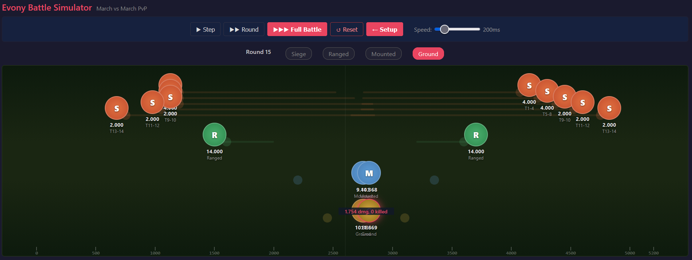

# Evony Battle Simulator &nbsp; 

**[Try it live](https://slowmock-a11y.github.io/evony-battle-simulator/)** | A browser-based march-vs-march PvP battle simulator for **Evony: The King's Return**, built to help players understand and experiment with the game's combat mechanics.

## Motivation

Evony's battle system is complex but poorly documented. Troop types, targeting priorities, damage formulas, and movement rules are spread across dozens of community posts and YouTube videos -- and some mechanics are still debated or unconfirmed. This simulator brings all of that knowledge into one place where you can **see it in action**.

**This is a work in progress.** The battle mechanics implemented here are based on the best community research available, but many facts are still unclear, missing, or approximated. If you have better data, corrections, or suggestions, contributions are very welcome -- open an issue or pull request.

The goal is to let players:
- **Visualize** how battles actually unfold round by round on a spatial battlefield
- **Experiment** with army compositions and buff setups without spending in-game resources
- **Understand** why certain troop layering strategies work (or don't) by watching targeting, movement, and damage play out step by step
- **Compare** results between configurations to find what makes a difference

## Features

- **Army Configuration** -- Set troop counts per type (Ground, Ranged, Mounted, Siege) and tier (T1-T14) for attacker and defender, with ATK/DEF/HP buff percentages
- **Step / Round / Full Playback** -- Advance the battle one attack at a time, one full round, or run to completion, with adjustable speed
- **Spatial Battlefield** -- A 5,200-unit linear field with troop movement, range indicators, speed projections, and animated attack arrows
- **Phase Indicator** -- See which troop type is currently attacking and what round you're in
- **Battle Log** -- Filterable log of every attack and movement event
- **Loss Summary** -- Side-by-side comparison of surviving troops with per-type breakdowns
- **Run Comparison** -- After resetting, see how your new configuration compares to the previous run
- **Battle Mechanics Reference** -- Built-in fact sheet with detailed rules and links to community sources

## Tech Stack

Pure client-side, zero dependencies:
- Vanilla JavaScript (IIFE modules)
- Plain CSS
- No build tools, no frameworks, no npm

Open `index.html` in any modern browser to use.

## Architecture

| Module | File | Role |
|--------|------|------|
| TroopData | `js/troop-data.js` | Base stats, type definitions, phase order |
| BattleEngine | `js/battle-engine.js` | Pure simulation -- armies in, event log out (no DOM) |
| ArmyConfig | `js/army-config.js` | Setup UI -- troop grid and buff inputs |
| Battlefield | `js/battlefield.js` | Spatial rendering, unit markers, attack arrows, indicators |
| Playback | `js/playback.js` | Steps through the event array at user-controlled speed |
| BattleLog | `js/battle-log.js` | Filterable log panel |
| App | `js/app.js` | Wires everything together, manages state |

The engine is intentionally separated from the UI: `BattleEngine.simulate()` takes two armies and returns a complete event log. The playback system then walks that log, applying events to display copies of the armies and rendering each step.

## Battle Mechanics Modeled

- Four troop types with full T1-T14 stat tables
- Phase-based attack order (Siege > Ranged > Mounted > Ground)
- Attacker-first within each phase, higher tiers before lower
- Linear battlefield with independent per-type positions and movement
- Range-based hold/advance movement rules
- Full targeting priority chains per troop type
- Damage formula: `troopCount x ATK x modifier x ATK / (ATK + DEF)`
- Counter triangle: Ranged > Mounted > Ground > Ranged (1.2x), Siege > Siege (1.5x)
- ATK/DEF/HP buff percentages per troop type

## Not Yet Modeled

- Generals (base stats, skills, specialties, ascending stars)
- Equipment on generals
- Research / Technology / Civilization / Alliance buffs
- Monarch Gear & Sub-city buffs
- Wounded vs Killed ratio
- Wall / Trap mechanics (city attacks)
- Rally mechanics (multi-march)

## Contributing

The battle mechanics in this simulator are incomplete. Many details are uncertain or based on community best guesses rather than confirmed data. If you notice something wrong, know a mechanic that's missing, or have better sources -- please open an [issue](https://github.com/slowmock-a11y/evony-battle-simulator/issues) or submit a pull request. All contributions, corrections, and suggestions are welcome.

## References

Community sources used for the simulation rules:

- [Theria Games -- Troop Base Stats](https://theriagames.com/guide/troop-base-stats/)
- [Theria Games -- Evony Guides](https://theriagames.com/evony-guides/)
- [Evony Guide Wiki](https://evonyguidewiki.com/en/index-en/)
- [EvonyTips -- How Battles Work](https://www.evonytips.com/index/strategy/how-the-battles-work-battle-mechanics)
- [Evony Answers -- Battle Mechanics Forum](https://www.evonyanswers.com/forum/evony-battle-mechanics/)
- [Server 806 -- Battle Mechanics](https://www.server806.com/post/battle-mechanics)
- [Top Games (Official) -- About Battle Mechanics](https://topgamesinc.zendesk.com/hc/en-us/articles/360047535191-About-Evony-Battle-Mechanics)

- [DerrickDefies -- YouTube](https://www.youtube.com/@DerrickDefies) -- Battle mechanics deep-dives

## License

[MIT](LICENSE)
